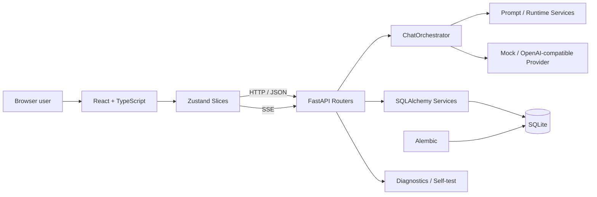

**English | [中文](README.zh-CN.md)**

# AI Tavern Lite

> A local-first, rollback-safe, fully tested AI character-card roleplay platform.

AI Tavern Lite is built with React, TypeScript, FastAPI, SQLAlchemy and SQLite. It imports Character Card V2/V3 cards, connects to OpenAI-compatible models, and maintains per-session characters, personas, worldbooks, story state and timelines.

The project is positioned as a **2.x Preview, local single-user application**. It is both usable software and an engineering-practice portfolio project designed around AI application quality, streaming communication, data migration and compatibility.

## Quality Baseline

As of the 2026-09-09 local verification run:

```text
Backend pytest:      466 passed (full suite, real run)
Frontend vitest:     102 passed
TypeScript check:    pass
Vite production build: pass
Alembic head:        20260722_0005
Database tables:     14 business tables
Long-session check:  1,002 messages returned complete and ordered
```

Release gating is executed by `verify-release.ps1`: required files, Python/Node environment, sensitive-file checks, Python compilation, Alembic migration graph, backend tests, frontend tests and production build.

## Key Capabilities

### Character cards & content management

- Import Character Card V2/V3 from JSON and PNG;
- Create, edit, delete and export characters;
- Preserve unknown extension fields, strict CCv3 output structure;
- Worldbook entries with CRUD, keyword triggers, always-on entries and probability fields;
- Primary/alternate greetings editing, ordering, dedup and preview;
- Compatibility reports covering card protocol, worldbook, MVU, status bars and unknown extensions.

### Sessions & immersive runtime

- Single-character and multi-character group sessions;
- Persona binding, main-character selection, custom titles and greeting sources;
- Custom initial-state JSON with rejection of dangerous paths and oversized content;
- SSE streaming replies, stop generation, regeneration and prompt preview;
- Per-session storage of messages, runtime state, timeline, drafts and scroll position;
- Frontend loads the latest 50 messages by default; scroll-to-top pagination keeps reading position;
- Story branching, state snapshots and rollback;
- Body text is separated from hidden state-operation contracts; arbitrary JavaScript shipped inside cards is never executed;
- P4.0 unifies `<tavern_state>`, Tavern MVU commands, JSONPatch, variable blocks and state-recovery output into the internal `ai-tavern-state-operations/1` contract, shown as Decision Trace (Contract → Alias → Policy → Schema → Apply);
- Safe-compatible Tavern MVU JSON/YAML initial variables, `get_message_variable`, array-path controllers and the `_.set/add/insert/remove` update protocol;
- When a card declares a variable protocol but the main reply omits the state block, one bounded state extraction runs automatically; no-op extractions do not bump the runtime version;
- Card-declared initial affection, fear, dependency, injuries and key memories are rendered by the native status panel; old sessions backfill safely by runtime version.

### Engineering & reliability

- Zustand stores split by character, session, conversation, chat, settings and UI, with a single explicit owner for messages/runtime state;
- Backend chat flow orchestrated by `ChatOrchestrator`; stream coordination, state recovery, observed side effects and message lifecycle each have their own owner;
- Model configuration validated before the pending message is written;
- Old stream callbacks cannot pollute a new session after browser disconnect or session switch;
- Concurrent requests to the same resource are deduplicated; stale responses cannot overwrite the current session;
- Bounded recent-session cache; pagination state isolated per session;
- Alembic-managed database versions with dedicated takeover and failure-recovery tests;
- Diagnostics logs and export bundles are redacted by default: no API keys, no full prompts, no full chat transcripts.

## Architecture



Details: [`docs/ARCHITECTURE.md`](docs/ARCHITECTURE.md).

## Quick Start

### Requirements

- Windows 10/11;
- Python 3.11;
- Node.js 22+;
- npm.

### Install & run

```powershell
Set-Location "D:\AI-Tavern-Lite"

.\setup.ps1
.\start.ps1
```

Then open:

```text
http://127.0.0.1:8000
```

Mock mode works without an API key — useful for feature demos and offline acceptance.

### Android mobile web

The mobile web client keeps data and model calls on the Windows PC; the phone only renders and interacts. Quick start:

```powershell
.\allow-mobile-firewall.bat  # run once
.\start-mobile.bat
```

The launch window shows the phone URL and requires a per-session password of at least 12 characters. Phone and PC must share one trusted private Wi-Fi. Details: [`MOBILE_WEB_QUICKSTART.md`](MOBILE_WEB_QUICKSTART.md). Designed for Windows 11 + Android Chrome; iOS device verification is not claimed.

## Model Configuration

Turn off Mock mode in Settings, then fill in:

- OpenAI-compatible Base URL;
- API Key;
- Model ID;
- Temperature, Top P, Max Tokens and other generation parameters.

The frontend checks configuration before sending; the backend re-checks and fails with explicit errors on missing config, unsafe URLs or provider initialization failures, so no empty messages or dirty data are left behind.

## Testing & Release Verification

Full gate:

```powershell
.\verify-release.ps1 -SkipNpmCi
```

Frontend only:

```powershell
Set-Location .\frontend
npm run check
```

Backend only:

```powershell
Set-Location .\backend
.\.venv\Scripts\python.exe -m pytest
```

Database state:

```powershell
Set-Location "D:\AI-Tavern-Lite"

.\scripts\database-migrate.ps1 status
.\scripts\database-migrate.ps1 validate
```

Test scope and manual acceptance records: [`docs/TEST_REPORT.md`](docs/TEST_REPORT.md).

## Data Migration & Backup

On startup the app runs:

```text
SQLite integrity backup
→ Alembic upgrade to head
→ verify tables, columns and key indexes
→ start service only on success
```

Current head is `20260722_0005`. Migration failures attempt to restore the pre-start backup; destructive downgrade to `base` is forbidden — roll data back with backups under `backend/data/backups`.

## Security Boundaries

- Listens on `127.0.0.1` by default;
- API keys are never returned to the frontend in plaintext and never written to ordinary logs; keys are stored via Windows DPAPI;
- Card JavaScript, EJS and remote scripts are not executed;
- Markdown goes through sanitization;
- SSRF, request-size, rate-limit and production-config fail-closed tests included;
- The public repository must never contain `.env`, databases, backups, diagnostic bundles, `node_modules` or build artifacts.

Local development may use `auth=False`. Public deployment requires authentication, trusted hosts, production environment variables and access control.

## AI-Assisted Development Note

This project uses AI tooling for code generation, refactoring suggestions and analysis. Requirement trade-offs, feature acceptance, bug reproduction, log judgement, test execution, version control and regression verification were continuously performed by the project maintainer.

Risk controls for AI-assisted changes:

- small-step Git commits;
- source-hash checks and backups before edits;
- automated tests and production-build gates;
- Mock + real-model dual-path acceptance;
- modular splits for oversized files;
- regression tests for historical bugs.

Cases: [`docs/BUG_CASES.md`](docs/BUG_CASES.md).

## Current Limitations

- Local single-user, single-app-copy operation is the primary mode;
- SQLite, stop-generation state and local caches are not designed for horizontal scaling;
- No TTS, speech recognition, image generation or vector database;
- Arbitrary third-party SillyTavern/Risu scripts are not guaranteed to run equivalently;
- 1,002-message integrity test passed and cursor pagination is wired on both ends; virtual lists, timeline pagination and prompt-history query optimization remain future performance work;
- The repo carries production-oriented configuration, but public-internet deployment is out of scope for this portfolio's acceptance.

## Portfolio Documents

- [`docs/ARCHITECTURE.md`](docs/ARCHITECTURE.md) — system architecture, request chain, design boundaries;
- [`docs/TEST_REPORT.md`](docs/TEST_REPORT.md) — automated tests, manual acceptance, quality conclusions;
- [`docs/BUG_CASES.md`](docs/BUG_CASES.md) — interview-ready bug and refactor cases;
- [`docs/DEMO_SCRIPT.md`](docs/DEMO_SCRIPT.md) — 3–5 minute demo script;
- [`docs/INTERVIEW_GUIDE.md`](docs/INTERVIEW_GUIDE.md) — walkthrough and common follow-up questions;
- [`docs/RESUME_PROJECT_SECTION.md`](docs/RESUME_PROJECT_SECTION.md) — resume project section template.

## License

This project is licensed under the [MIT License](LICENSE). Third-party dependencies retain their respective licenses.
