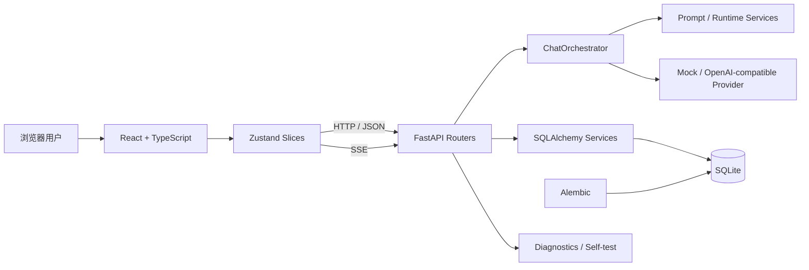

**[English](README.md) | 中文**

# AI Tavern Lite

> 本地优先、可回滚、可测试的 AI 角色卡运行平台。

AI Tavern Lite 使用 React、TypeScript、FastAPI、SQLAlchemy 和 SQLite 构建，支持导入 Character Card V2/V3 角色卡，连接 OpenAI 兼容模型，并为每个会话维护独立的角色、Persona、世界书、剧情状态和时间线。

项目目前定位为 **2.x Preview 本地单用户应用**。它既是可实际使用的软件，也是一个围绕 AI 应用质量、流式通信、数据迁移和兼容性设计完成的工程实践项目。


**为什么这不是又一个聊天 demo：**

- **角色卡是不可信数据，永远不是代码。**卡片内携带的任意 JavaScript 从不执行；卡片协议（CCv2/v3、世界书、MVU、状态栏）先解析、出报告、做兼容性检查后才使用。
- **对话是有状态工程。**SSE 流式 + 会话切换竞态防护、可回滚的剧情状态与时间线、Alembic 迁移的 SQLite + 备份/恢复，1002 条消息有序完整性已验证。
- **发布靠门禁，不靠感觉。**一个脚本（`verify-release.ps1`）在任何发布前统一检查必需文件、环境、敏感文件、迁移图、后端测试、前端测试与生产构建。

## 演示

公开截图尚未提交——需先通过 [`docs/SCREENSHOT_CHECKLIST.md`](docs/SCREENSHOT_CHECKLIST.md) 的隐私清单。最快的上手演示无需 API Key：按下方快速启动以默认 **Mock 模式** 运行完整 UI，再按 [`docs/DEMO_SCRIPT.md`](docs/DEMO_SCRIPT.md) 走一边 3～5 分钟流程（导卡 → 世界书触发 → 流式回复 → 状态追踪 → 分支 → 回滚 → 备份/恢复）。

## 当前质量基线

下列数字与本仓库已公开的 `main` 快照一致（更完整的测试套件运行在尚未发布的本地分支上；数量随版本增长，以实际运行命令为准）：

```text
后端自动测试：312 passed（全量实跑）
前端自动测试：79 passed
TypeScript 检查：通过
Vite 生产构建：通过
Alembic head：20260720_0003
数据库业务表：12 张
长会话完整性：1002 条消息完整、有序测试通过
```

发布门禁由 `verify-release.ps1` 统一执行，包括必需文件、Python/Node 环境、敏感文件、Python 编译、Alembic 迁移图、后端测试、前端测试和生产构建。

## 主要能力

### 角色卡与内容管理

- 导入 Character Card V2/V3 JSON 与 PNG 角色卡；
- 创建、编辑、删除和导出角色；
- 保留未知扩展字段，严格输出 CCv3 结构；
- 世界书条目增删改查、关键词触发、常驻条目和概率字段；
- 主开场白与备用开场白编辑、排序、去重和预览；
- 兼容性报告展示角色卡协议、世界书、MVU、状态栏和未知扩展。

### 会话与沉浸式运行时

- 单角色与多人编组会话；
- Persona 绑定、主角色选择、自定义标题和开场白来源；
- 自定义初始状态 JSON，并拒绝危险路径和超限内容；
- SSE 流式回复、停止生成、重新生成和 Prompt 预览；
- 每个会话独立保存消息、运行时状态、时间线、草稿和滚动位置；
- 前端默认只加载最近 50 条消息，滚动到顶部可继续加载更早消息，并保持当前阅读位置；
- 剧情分支、状态快照和回滚；
- 将正文与隐藏状态操作合同分离，不执行角色卡携带的任意 JavaScript；
- P4.0 统一 `<tavern_state>`、Tavern MVU 命令、JSONPatch、变量块和状态恢复输出为 `ai-tavern-state-operations/1` 内部合同，并在 Decision Trace 中按 Contract → Alias → Policy → Schema → Apply 展示；
- 安全兼容 Tavern MVU JSON/YAML 初始变量、`get_message_variable`、数组路径控制器，以及 `_.set/add/insert/remove` 更新协议；
- 当角色卡声明变量协议但主回复漏写状态块时，可自动执行一次受限状态提取；空操作不增加运行时版本，诊断会标明更新来源；
- 角色卡初始好感、恐惧、依赖、伤势和重要记忆由原生状态面板展示，旧会话可按运行时版本安全回填。

### 工程与可靠性

- Zustand Store 按角色、会话、Conversation、聊天、设置和 UI 拆分，并明确消息/Runtime 的唯一所有者；
- 后端聊天流程由 ChatOrchestrator 统一编排，流协调、状态恢复、观察副作用和消息生命周期分别收口；
- 模型配置在写入待生成消息前完成校验；
- 浏览器断开或切换会话后，旧流回调不会污染新会话；
- 同资源并发请求去重，旧响应不能覆盖当前会话；
- 最近会话缓存有界，分页状态按会话隔离，旧请求不能串入当前会话；
- Alembic 管理数据库版本，旧库接管和失败恢复均有专项测试；
- 诊断日志与导出包默认脱敏，不包含 API Key、完整 Prompt 或完整聊天正文。

## 技术架构



详细说明见 [`docs/ARCHITECTURE.md`](docs/ARCHITECTURE.md)。

## 快速启动

### 环境

- Windows 10/11；
- Python 3.11；
- Node.js 22 或更高版本；
- npm。

### 安装与启动

```powershell
Set-Location "D:\AI-Tavern-Lite"

.\setup.ps1
.\start.ps1
```

启动后访问：

```text
http://127.0.0.1:8000
```

默认 Mock 模式无需 API Key，可用于功能演示和离线验收。

### 安卓移动网页版（开发中）

移动网页版正在未发布的开发分支上推进：数据与模型调用保留在 Windows 电脑，手机只负责显示与交互，规划包含本次访问密码与局域网防火墙处理。早期笔记中提到的辅助脚本与指南（`allow-mobile-firewall.bat`、`start-mobile.bat`、`MOBILE_WEB_QUICKSTART.md`）尚未包含在本公开快照中。设计目标为 Windows 11 与 Android Chrome；未宣称完成 iOS 真机验证。

## 模型配置

在“设置”页面关闭 Mock 模式，然后填写：

- OpenAI 兼容 Base URL；
- API Key；
- Model ID；
- Temperature、Top P、Max Tokens 等生成参数。

前端会在发送前检查配置；后端会再次检查，并在配置缺失、不安全 URL 或 Provider 初始化失败时返回明确错误，避免留下空消息或脏数据。

## 测试与发布验证

完整验证：

```powershell
.\verify-release.ps1 -SkipNpmCi
```

前端单独验证：

```powershell
Set-Location .\frontend
npm run check
```

后端单独验证：

```powershell
Set-Location .\backend
.\.venv\Scripts\python.exe -m pytest
```

数据库状态：

```powershell
Set-Location "D:\AI-Tavern-Lite"

.\scripts\database-migrate.ps1 status
.\scripts\database-migrate.ps1 validate
```

测试范围与人工验收记录见 [`docs/TEST_REPORT.md`](docs/TEST_REPORT.md)。

## 数据迁移与备份

应用启动时执行：

```text
创建 SQLite 一致性备份
→ Alembic 升级到 head
→ 校验表、字段和关键索引
→ 成功后启动服务
```

当前 head 为 `20260720_0003`。数据库迁移失败时会尝试恢复启动前备份，不执行破坏性自动 downgrade；初始迁移禁止破坏性降级到 `base`，需要回退数据时应使用 `backend/data/backups` 中的备份。（开发分支上的 0004/0005——会话背景外观表与 Canonical 状态投影表——尚未进入本快照。）

## 安全边界

- 默认只监听 `127.0.0.1`；
- API Key 不返回前端明文，不写入普通日志；
- 角色卡 JavaScript、EJS 和远程脚本不直接执行；
- Markdown 经过安全清洗；
- 包含 SSRF、请求大小、速率限制和生产配置 fail-closed 测试；
- 公开仓库不得包含 `.env`、数据库、备份、诊断包、`node_modules` 或构建产物。

本地开发模式可使用 `auth=False`。公开部署前必须启用认证、可信 Host、生产环境变量和访问控制。

## AI 辅助开发说明

本项目使用 AI 工具辅助代码生成、重构建议和问题分析。项目中的需求取舍、功能验收、错误复现、日志判断、测试执行、版本控制和回归验证由项目维护者持续参与完成。

为降低 AI 辅助修改风险，项目采用：

- 小步 Git 提交；
- 修改前源码哈希校验和备份；
- 自动测试与生产构建门禁；
- Mock 与真实模型双路径验收；
- 对大文件进行模块化拆分；
- 对历史 Bug 建立回归测试。

详细案例见 [`docs/BUG_CASES.md`](docs/BUG_CASES.md)。

Tavern MVU 兼容实现在 `backend/app/services/tavern_compat/`，配套跨卡与初始状态测试见 `backend/tests/test_tavern_compat_*.py`；行为规格文档随开发分支后续补充。

## 当前限制

- 当前以本地单用户、单应用副本为主要运行方式；
- SQLite、停止生成状态和本地缓存尚未针对多实例水平扩展；
- 未实现 TTS、语音识别、图片生成和向量数据库；
- 不保证任意第三方 SillyTavern/Risu 脚本等价运行；
- 1002 条消息已经通过完整性测试，前后端已接入游标分页；虚拟列表、时间线分页和 Prompt 历史查询优化仍属于后续性能工作；
- 仓库包含生产导向配置，但公网部署不属于当前作品集验收范围。

## 作品集资料

- [`docs/ARCHITECTURE.md`](docs/ARCHITECTURE.md)：系统架构、请求链路和设计边界；
- [`docs/TEST_REPORT.md`](docs/TEST_REPORT.md)：自动测试、人工验收和质量结论；
- [`docs/BUG_CASES.md`](docs/BUG_CASES.md)：可用于面试讲解的 Bug 与重构案例；
- [`docs/DEMO_SCRIPT.md`](docs/DEMO_SCRIPT.md)：3～5 分钟演示脚本；
- [`docs/INTERVIEW_GUIDE.md`](docs/INTERVIEW_GUIDE.md)：项目讲解与常见追问；
- [`docs/RESUME_PROJECT_SECTION.md`](docs/RESUME_PROJECT_SECTION.md)：简历项目经历模板；
- [`docs/SCREENSHOT_CHECKLIST.md`](docs/SCREENSHOT_CHECKLIST.md)：公开仓库截图清单；
- [`docs/LEGACY_README_2_2_PREVIEW.md`](docs/LEGACY_README_2_2_PREVIEW.md)：原详细功能说明存档。

## License

本项目采用 [MIT License](LICENSE)。第三方依赖保留其各自的许可证。

> 注：2.4.3 系列（状态提取热修复、角色卡安全还原、P0-4 架构收口）开发于未发布分支，其专项文档与部分实现尚未纳入本公开快照；随发布节奏补充。
