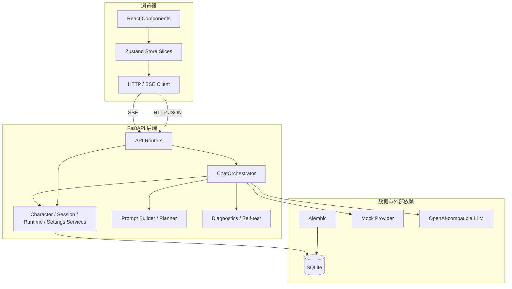
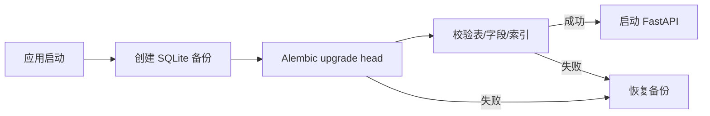
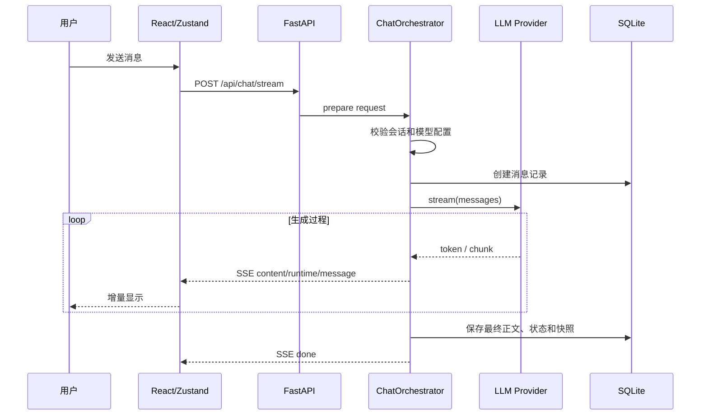

# AI Tavern Lite 架构说明

## 1. 系统边界

AI Tavern Lite 是一个本地优先的单用户 Web 应用。浏览器负责交互与会话缓存，FastAPI 负责业务规则和流式协议，SQLite 保存角色、会话、消息和运行时状态，外部模型通过 OpenAI 兼容接口接入。



## 2. 前端分层

### 组件层

负责页面布局、输入、弹窗、列表、运行时面板和错误反馈。高频组件使用细粒度 Store selector，避免流式消息更新时让无关页面统一重渲染。

### Zustand Store

Store 按职责拆分：

```text
characterSlice   角色加载、选择和兼容性
sessionSlice     会话、消息、运行时、时间线和缓存
chatSlice        发送、停止、重新生成和消息修改
settingsSlice    设置读取与保存
uiSlice          侧栏、抽屉、错误和页面状态
```

公共模块负责：

- 初始状态；
- 请求代次与竞态保护；
- SSE 回调失效；
- 聊天辅助函数；
- 类型定义。

### 会话可靠性策略

1. 同一会话、同一代次、同一资源的并发加载共享 Promise；
2. 旧响应可以写回对应会话缓存，但不能覆盖当前会话；
3. 切换会话、停止生成或清空选择后，旧流回调失效；
4. 浏览器最多保存 6 个最近会话缓存；
5. 消息与时间线通过 `message_id` 索引匹配，避免逐条全表扫描。

## 3. 后端分层

### API Routers

路由层只处理 HTTP 边界：

- 请求体和路径参数；
- 依赖注入；
- HTTP 状态码；
- StreamingResponse；
- 服务错误到 HTTP 的映射。

### ChatOrchestrator

聊天编排层统一处理：

```text
读取并校验会话
→ 加载角色、Persona、编组和记忆
→ 校验模型配置
→ 构建 Prompt
→ 创建待生成消息
→ 调用 Mock 或真实 Provider
→ 解析 SSE 内容与运行时补丁
→ 保存消息、快照和诊断
→ 清理活动任务
```

拆分后的关键模块：

```text
api/chat.py                         HTTP/SSE 边界
services/chat/orchestrator.py       公共编排入口
services/chat/preparation.py        上下文准备和预检
services/chat/stream_runner.py      流式执行和收尾
services/chat/context.py            流上下文
services/chat/helpers.py            SSE、序列化与脱敏
services/chat/errors.py             错误映射
```

### 预检原则

真实模型配置必须在写入用户消息和助手占位消息之前完成检查。缺少 API Key、模型或 Base URL 返回 422；不安全的本机或内网 URL 返回 422；意外 Provider 初始化错误返回 503。

流式开始后的上游错误继续通过 HTTP 200 内的 SSE `error` 与 `done` 事件表达，保持浏览器兼容。

## 4. 数据模型与迁移

SQLAlchemy 定义 11 张业务表，保存角色、世界书、会话、消息、记忆、设置、Persona、编组、分支、运行时和时间线相关数据。

数据库由 Alembic 管理：



当前迁移版本：`20260717_0001`。

旧无版本数据库的接管原则：

- 不重建已有业务表；
- 补齐已知旧字段；
- 修复重复消息序号；
- 创建关键唯一索引；
- 增加 `alembic_version`；
- 迁移前后业务数据保持一致。

## 5. 聊天流式协议



主动停止或浏览器断开时，活动任务被取消，消息状态保存为 `stopped`，部分状态补丁不会误应用。

## 6. Prompt 与运行时

Prompt 按平台规则、角色核心、运行时协议、世界书、记忆、Persona/群组和最近历史分配预算。最近聊天拥有独立保留空间，角色卡和世界书不能无限挤占历史。

模型正文与机器可读状态块分离。运行时解析器只接受受限 JSON Patch 和平台协议，拒绝私有路径、原型污染路径、超限内容和不支持的操作。

## 7. 安全与诊断

安全边界包括：

- 本地默认监听；
- API Key 掩码与日志脱敏；
- SSRF 防护；
- 请求体和 API 速率限制；
- Basic Auth 与生产 fail-closed；
- 安全响应头；
- Markdown 清洗；
- 禁止直接执行角色卡脚本。

诊断系统记录请求状态、首字延迟、Token 估算、世界书数量、历史裁剪和安全错误类型。导出包默认不含完整聊天、完整 Prompt、角色卡正文、API Key 或自定义请求头值。

## 8. 设计取舍

### 为什么使用 SSE

当前核心需求是服务器单向、持续地把模型文本推送给浏览器。SSE 使用普通 HTTP，浏览器实现简单，适合文本生成；项目暂时不需要 WebSocket 的全双工协议复杂度。

### 为什么使用 SQLite

项目定位是本地单用户工具。SQLite 无需额外服务，便于备份和迁移。代价是当前不适合多实例并发写入，因此公开部署仍使用单进程、单应用副本。

### 为什么不执行角色卡 JavaScript

直接执行第三方脚本会扩大 XSS、数据读取和密钥泄漏风险。项目只保留数据和显示意图，再转换为平台原生状态、组件和安全宏。

### 为什么保留 Mock Provider

Mock 路径让安装、自检、演示和回归测试不依赖外部余额、网络或 API Key，也能区分“产品逻辑错误”和“模型供应商错误”。
